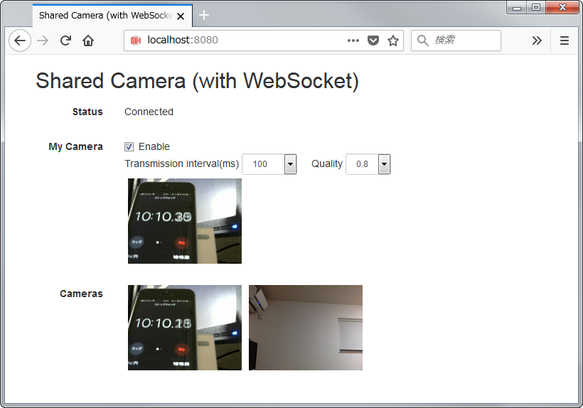

# Shared Camera with WebSocket

WebSocketを利用してカメラの映像を共有するアプリケーションのプロトタイプです。

Raspberry Piにカメラをつなげて監視カメラにしたり、ブラウザを通してお互いのカメラの映像を共有するようなことができます。



## 構成

WebSocketのバイナリメッセージで画像をブロードキャストするようなイメージです。WebSocketサーバは、クライアントより受け取った画像に対して送信元を一意に判別する情報を付与した上で、全てのクライアントに対して送りつけます。

以下は本プロトタイプで提供する2つのアプリケーションの説明となります。

### 1. WebSocketサーバ(＋Webブラウザ向けクライアント)

Webアプリケーションとして、WebSocketのサーバとブラウザ向けのクライアントを提供します。

WebSocketのサーバは、受信した画像を送信元の情報を一意に識別する情報(サーバ側で管理しているWebSocketのセッションID)を付与したうえで全クライアントに送付します。実装にはJavaを使用しています。(Spring BootによるWebアプリケーション)

ブラウザ向けのクライアントでは、カメラによる撮影と、各クライアントの画像を表示する機能を提供します。`MediaDevices.getUserMedia`を通じてカメラの映像を取得、それを`<video>`で動画として表示しています。
WebSocketでサーバに送る画像は、そこからさらに`<canvas>`に書き込んで、jpegのバイナリにしてから送っています。

サーバ側から受信した画像は、バイナリの先頭部分に付与した送信元を識別する情報を元に、送信元毎に表示します。クライアントが画像を短い間隔で送信することによって、動画に近い形で見せることも可能です。

### 2. WebSocketクライアント

カメラの画像を送信するWebSocketクライアントです。こちらもJavaで実装しています。(Spring Bootによるコマンドラインアプリケーション)

カメラからの画像取得は、OSやデバイスによって差がありますが、下記のライブラリを利用することによって差を吸収し、一つのアプリケーションとして実装することができました。

* [Webcam Capture in Java](http://webcam-capture.sarxos.pl/)

## 実行方法

動作にはJava8が必要となりますので、各動作環境に応じたインストール方法でインストールのうえ、実行するようにしてください。

### 1. WebSocketサーバ(＋Webブラウザ向けクライアント)

下記のファイルをダウンロードします。

* https://github.com/onozaty/shared-camera-websocket/releases/download/v0.0.1/shared-camera-server-0.0.1.jar

ダウンロードしたファイルを指定して実行します。

```
java -jar shared-camera-server-0.0.1.jar
```

サーバはポート番号8080で起動します。

下記URLをブラウザで開くと、アプリケーションの画面が表示されます。(ローカル以外で実行している場合には、localhost部分を実行環境のアドレスに変更してください)

* http://localhost:8080/


画面上の各項目の説明は下記の通りです。

* Status
  * サーバとの接続状況を表します。Connectedが接続中の状態となります。
* My Camera
  * 自分のカメラになります。"Enable"にチェックすると、カメラが有効となり、映像が表示されます。
  * "Transmission interval(ms)"は、サーバに画像を転送する間隔(ミリ秒)です。この間隔が短いと、動画に近い形で見ることができます。
  * "Quality"は画像(jpeg)の品質です。
* Cameras
  * 各クライアントのカメラの映像となります。MyCameraをEnableにしていた場合、自分自身の映像もここに表示されます。

### 2. WebSocketクライアント

下記のファイルをダウンロードします。

* https://github.com/onozaty/shared-camera-websocket/releases/download/v0.0.1/shared-camera-client-0.0.1.jar

ダウンロードしたファイルを指定して実行します。

```
java -jar shared-camera-client-0.0.1.jar
```

デフォルトでは、localhostに対して接続しに行くため、サーバを別の環境で動作させている場合には、接続先を引数(`--websocket.uri=ws://{サーバアドレス}:8080/endpoint`)として指定する必要があります。たとえばサーバを192.168.1.100で起動していた場合、下記のような指定になります。

```
java -jar shared-camera-client-0.0.1.jar --websocket.uri=ws://192.168.1.100:8080/endpoint
```

他にも、下記のような引数が指定可能です。

* `--camera.interval-millis`
  * サーバに画像を転送する間隔(ミリ秒)です。デフォルトでは100となっています。
* `--camera.use-v4l4j`
  * ドライバとしてv4l4jを利用するかを切り替えます。デフォルトはfalseで、v4l4jを利用しません。Raspberry Piの場合、v4l4jを使うことが推奨されており、実際にv4l4jを利用したほうが安定しました。
    * https://github.com/sarxos/webcam-capture/wiki/How-To-Configure-Raspberry-Pi

サーバの接続先が192.168.1.100で、画像の転送間隔が1秒、ドライバとしてv4l4jを利用する場合、下記のようなコマンドとなります。

```
java -jar shared-camera-client-0.0.1.jar --websocket.uri=ws://192.168.1.100:8080/endpoint --camera.interval-millis=1000 --camera.use-v4l4j=true
```
